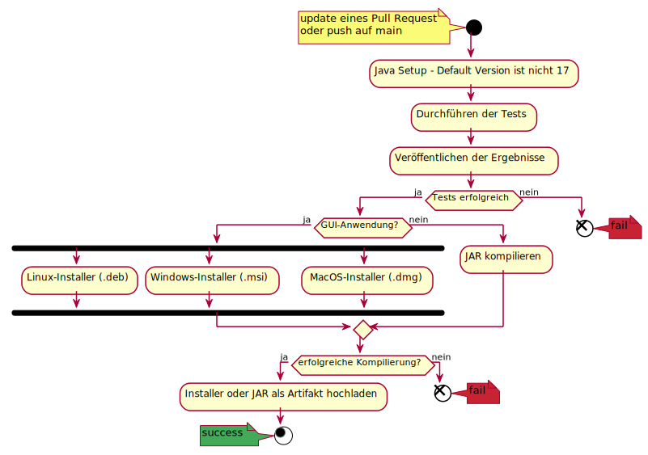

# Weichware-10: Repo-Utils
Dieses Repository beinhaltet:
- [Workflows](workflows/),
- [.gitignore](.gitignore),
- [Checkstyle](checkstyle.xml)

welche alle in den folgenden Java-Repositories benötigt werden:
- [weichware10/toolbox](https://github.com/weichware10/toolbox)
- [weichware10/analyse](https://github.com/weichware10/analyse)
- [weichware10/util](https://github.com/weichware10/util)

und dort auch den gleichen Stand haben sollten.

---

## Workflows

### Update
Der [update](.github/workflows/update.yaml)-Workflow in diesem Repository sendet die Information über das Update an die anderen Repositories, welche das Update mit ihrem [update](workflows/update.yaml)-Workflow entgegennehmen und dem main-Branch comitten.

### Tests
Der [tests](workflows/tests.yaml)-Workflow wird bei Änderungen von Java- und XML-Dateien aufgerufen und führt die Tests mit `mvn test` durch. Die Ergebnisse der Tests sind dann in Pull Requests einsehbar. Pull Requests dürfen nur gemerged werden, wenn keine Fehler mehr auftreten. Der Workflow schlägt auch fehl, falls der Build fehlschlägt.

